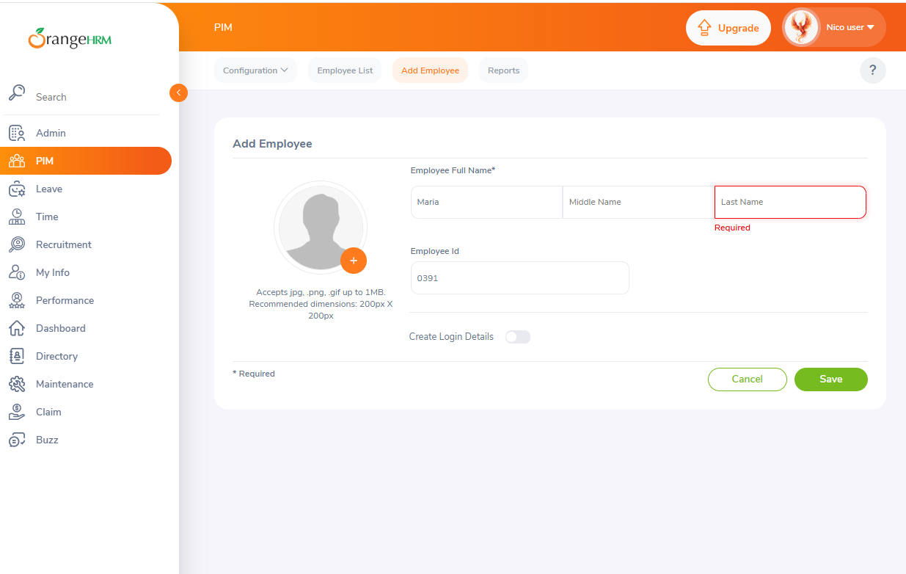
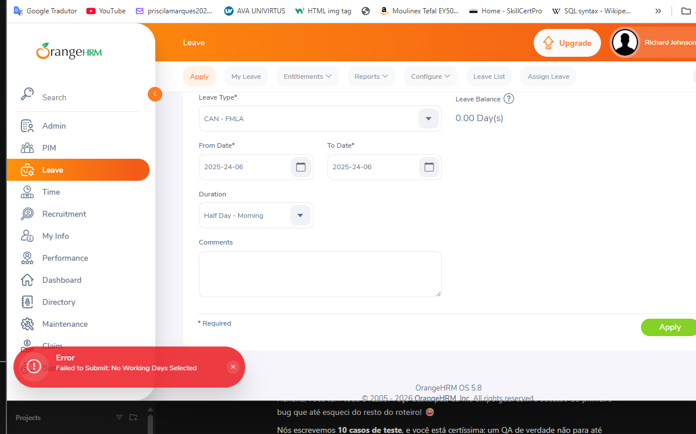

# OrangeHRM - Bug Reports

Use the template below to report any defects (bugs) found during test execution.

---

## 🐛 Bug Report Template

**Bug ID:** BUG-001 *(Example)*
**Title:** [Module] - Brief description of the problem (e.g., [Login] 500 Internal Server Error when logging in with special characters)

**Environment:**
- **URL:** https://opensource-demo.orangehrmlive.com/
- **Browser:** Chrome (v120) / Firefox / Edge
- **OS:** Windows 11 / macOS

**Steps to Reproduce:**
1. Navigate to page X.
2. Click on button Y.
3. Enter data Z.

**Expected Result:**
What should have happened according to the requirements (e.g., The system should display a friendly validation error message).

**Actual Result:**
What actually happened (e.g., The system crashed and displayed a 500 error in the console).

**Severity:** Critical / High / Medium / Low
*(Severity: How much does this bug break the system?)*

**Priority:** High / Medium / Low
*(Priority: How fast do we need to fix this?)*

**Attachments:**
- [Insert screenshots, screen recordings, or console logs here]

---

## 📝 Logged Bugs

1. ## 📝 Logged Bugs- BUG-001

*(Add the bugs you find during your testing below, using the template above)*

**Bug ID:** BUG-001
**Title:** [PIM] - System prevents registration of employees without a Last Name (Mononymous persons)

**Environment:**
- **URL:** https://opensource-demo.orangehrmlive.com/
- **Browser:** Chrome
- **OS:** Windows 11

**Steps to Reproduce:**
1. Navigate to "PIM" -> "Add Employee".
2. Enter a "First Name" and "Middle Name".
3. Leave the "Last Name" field blank.
4. Click "Save".

**Expected Result:**
The system should allow saving the profile, as some individuals legally possess only a single name (mononym). Only "First Name" should be strictly mandatory.

**Actual Result:**
The system marks "Last Name" as a required field in red and completely blocks the registration.

**Severity:** Medium
**Priority:** Medium

**Attachments:**

2. ## 📝 Logged Bug- BUG-002

*Bug ID:** BUG-002
**Title:** [Leave] - Misleading error message when entering an invalid/past date.

**Environment:**
- **URL:** https://opensource-demo.orangehrmlive.com/
- **Browser:** Chrome
- **OS:** Windows 11

**Steps to Reproduce:**
1. Navigate to "leave" -> "Apply".
2. Select a "Leave Type".
3. Set the "From Date" and "To Date" to a month ago or year ago.
4. Click "Apply".
**Expected Result:** The system should display a clear message like "Invalid date" or "Cannot apply for leave in the past".
**Actual Result:** The system blocks the submission but displays an unrelated error message: "No Working Days Selected".
**Severity:** Low
**Priority:** Low   
**Attachments:**

